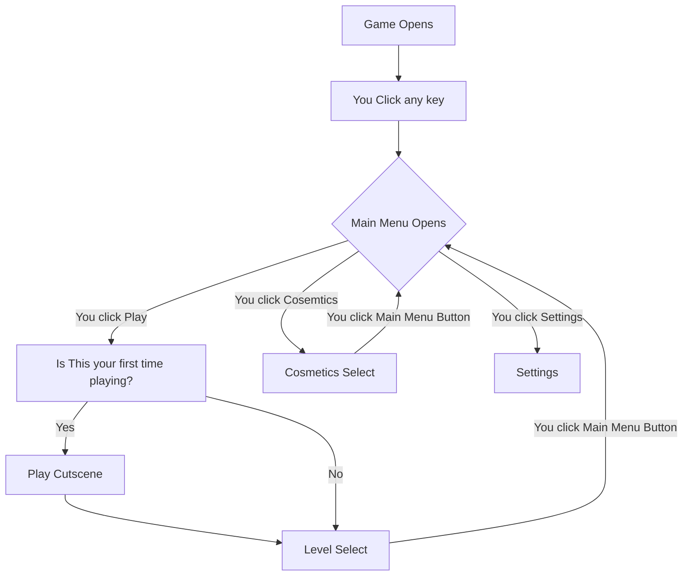

#projects 
Summer In December!!! is a pixel art platformer where the objective is to fight through some monsters (based on things that are hot) and get to a freezer before you melt (as you are a snowman).  Coded in [[Python]] with PyGame. The main character is Pete Sleet, a snowman from the North Pool. One day, he decides to leave his snowy home to meet a lady friend, Francesca Flurry! He grabs his trusty snowball launcher and journeys into nice cut lawns, sandy beaches, and a volcano! Fight against tiresome foes and challenge yourself with treacherous platforming in, Summer in December! 
# Recent Developments: I am leaving this project!!!
This is not a failure as I learned exactly what I wanted to learn particularly being if game design is for me. I discovered not just that it isn't for me, I need to have my projects to be smaller scope especially at first, and to plan my projects step by step better.

## Random thoughts while working on the project
Gotta learn pygame so that might take a lil but I'm so excited! Remember to split it into different files and use classes and shit. yk Object Oriented Programming and what not. FUCK I LOVE PIXEL ART!!!!

## Game Flowchart

## Game Characters and Objects
![[Snowball_Projectile.png]] ![[THE_SNOWMAN.png]] ![[Player_Snowman.png]] 
## Large Goals
- [ ] Finish first version of game with 3 different levels
- [ ] Add 2 more levels
- [ ] Add a final boss (me!?!)
- [ ] post it to itch.io
- [ ] Make game work in browser on itch.io 
- [ ] Ask some friends to play and review said game
## To-do list
- [x] rename (again) to summer in December 
- [x] Choose if I'm gonna use PyGame or Godot or whatever
- [x] Make flowchart for game in obsidian (and figure out how I'm gonna do that)
- [x] Learn how I'm gonna make the different sprites
- [x] Make snowman player sprite
- [x] Make basic up down forward movement (without physics or ground or nothing)
- [x] Use aseprite to make sprites for the game (pay the fee first)
- [x] Make sprite change with direction
- [x] make sprite sheet
- [x] add Collisions thing (go back in the video and fucking listen this time)
- [x] make pause functionality
- [x] Make basic physis i.e gravity
- [x] make another snowman this time facing the right direction 
- [ ] add konami code for cool trick
- [x] make the title page
- [ ] Make the first level and a bunch of tiles
- [ ] add enemies functionality
- [ ] add sound effects
- [x] make snowball shoot out of snowball launcher 
- [x] add background music 
- [ ] add death page with text "YOU MELTED" on it
- [ ] add death music which is chopins funeral song but christmas themed 
- [ ] add coyote time 
- [x] add a crt shader to game
- [x] add enemy sprite (pink lawn flamingo that moves via jumping)
- [x] Make summer in main page beach themed and December have iciciles hanging off of it

